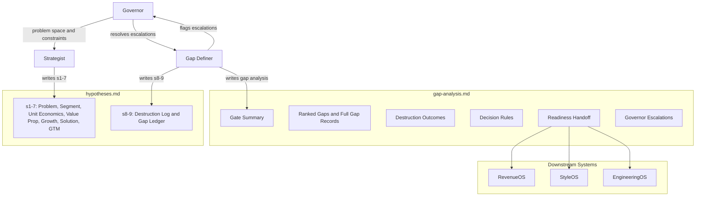
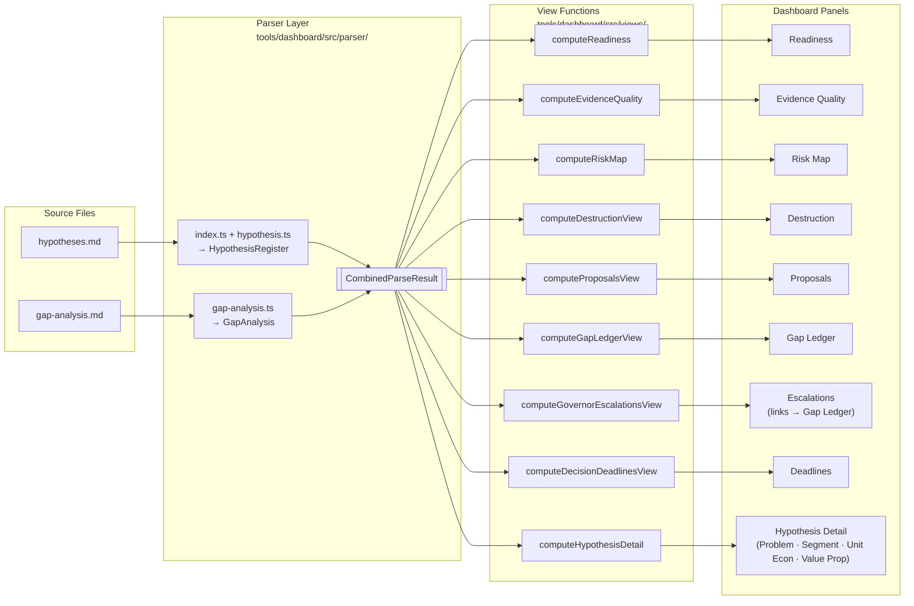
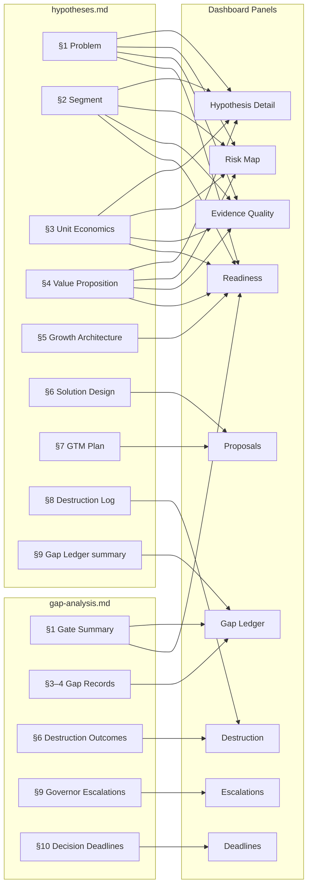

# StrategistOS — Information Flow

## 1. System-Level Flow

```mermaid
flowchart TD
    GOV["Governor"]
    STR["Strategist"]
    GAP["Gap Definer"]

    subgraph HYP["hypotheses.md"]
        H17["s1-7: Problem, Segment, Unit Economics, Value Prop, Growth, Solution, GTM"]
        H89["s8-9: Destruction Log and Gap Ledger"]
    end

    subgraph GAPMD["gap-analysis.md"]
        GA1["Gate Summary"]
        GA34["Ranked Gaps and Full Gap Records"]
        GA6["Destruction Outcomes"]
        GA7["Decision Rules"]
        GA8["Readiness Handoff"]
        GA9["Governor Escalations"]
    end

    subgraph DS["Downstream Systems"]
        REV["RevenueOS"]
        STY["StyleOS"]
        ENG["EngineeringOS"]
    end

    GOV -->|"problem space and constraints"| STR
    STR -->|"writes s1-7"| H17
    GAP -->|"writes s8-9"| H89
    GAP -->|"writes gap analysis"| GA1
    GAP -->|"flags escalations"| GOV
    GOV -->|"resolves escalations"| GAP

    GA8 --> REV
    GA8 --> STY
    GA8 --> ENG
```

---

## 2. Markdown → Dashboard Flow

```mermaid
flowchart LR
    subgraph SRC["Source Files"]
        HYP["hypotheses.md"]
        GAPMD["gap-analysis.md"]
    end

    subgraph PARSE["Parser Layer\ntools/dashboard/src/parser/"]
        P1["index.ts + hypothesis.ts\n→ HypothesisRegister"]
        P2["gap-analysis.ts\n→ GapAnalysis"]
        CR[["CombinedParseResult"]]
    end

    subgraph VIEWS["View Functions\ntools/dashboard/src/views/"]
        VR["computeReadiness"]
        VE["computeEvidenceQuality"]
        VRI["computeRiskMap"]
        VD["computeDestructionView"]
        VP["computeProposalsView"]
        VGL["computeGapLedgerView"]
        VES["computeGovernorEscalationsView"]
        VDL["computeDecisionDeadlinesView"]
        VHD["computeHypothesisDetail"]
    end

    subgraph PANELS["Dashboard Panels"]
        RP["Readiness"]
        EP["Evidence Quality"]
        RIP["Risk Map"]
        DP["Destruction"]
        PP["Proposals"]
        GLP["Gap Ledger"]
        ESP["Escalations\n(links → Gap Ledger)"]
        DLP["Deadlines"]
        HDP["Hypothesis Detail\n(Problem · Segment · Unit Econ · Value Prop)"]
    end

    HYP --> P1 --> CR
    GAPMD --> P2 --> CR

    CR --> VR --> RP
    CR --> VE --> EP
    CR --> VRI --> RIP
    CR --> VD --> DP
    CR --> VP --> PP
    CR --> VGL --> GLP
    CR --> VES --> ESP
    CR --> VDL --> DLP
    CR --> VHD --> HDP
```

---

## 3. Section-to-Panel Mapping

```mermaid
flowchart LR
    subgraph HYP["hypotheses.md"]
        S1["§1 Problem"]
        S2["§2 Segment"]
        S3["§3 Unit Economics"]
        S4["§4 Value Proposition"]
        S5["§5 Growth Architecture"]
        S6["§6 Solution Design"]
        S7["§7 GTM Plan"]
        S8["§8 Destruction Log"]
        S9["§9 Gap Ledger summary"]
    end

    subgraph GAPMD["gap-analysis.md"]
        G1["§1 Gate Summary"]
        G34["§3–4 Gap Records"]
        G6["§6 Destruction Outcomes"]
        G9["§9 Governor Escalations"]
        G10["§10 Decision Deadlines"]
    end

    subgraph PANELS["Dashboard Panels"]
        RP["Readiness"]
        EP["Evidence Quality"]
        RIP["Risk Map"]
        DP["Destruction"]
        PP["Proposals"]
        GLP["Gap Ledger"]
        ESP["Escalations"]
        DLP["Deadlines"]
        HDP["Hypothesis Detail"]
    end

    S1 --> RP & EP & RIP & HDP
    S2 --> RP & EP & RIP & HDP
    S3 --> RP & EP & RIP & HDP
    S4 --> RP & EP & RIP & HDP
    S5 --> RP
    S6 --> PP
    S7 --> PP
    S8 --> DP
    S9 --> GLP

    G1 --> RP & GLP
    G34 --> GLP
    G6 --> DP
    G9 --> ESP
    G10 --> DLP
```
